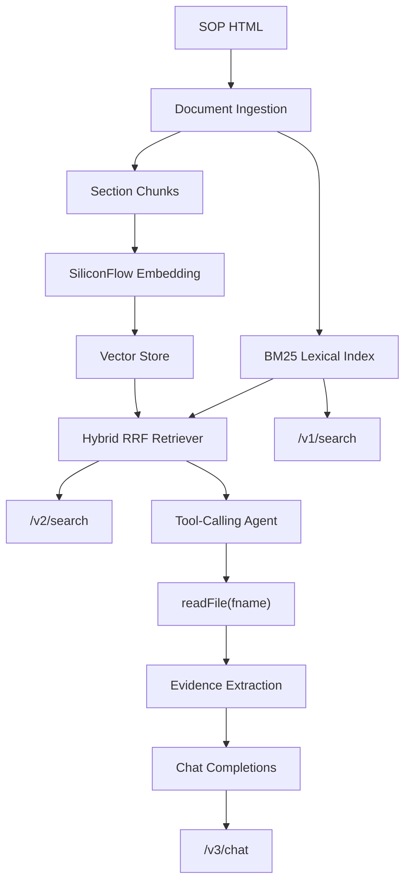

# On-Call Copilot Architecture

这个项目把题目的三阶段做成一个完整的 RAG-to-Agent 系统，而不是三段互不相干的 demo。HTTP 路由只负责参数、响应和静态页面分发，真正的解析、检索、向量、Agent 工具调用都在 `oncall_app/` 的独立模块里。

## Module Boundaries

- `frontend/`: 静态 HTML/CSS/JS，只调用 `/v1/search`、`/v2/search`、`/v3/chat`。
- `oncall_app/api/`: FastAPI app factory、thin routes、Pydantic response shaping。
- `oncall_app/documents/`: BeautifulSoup HTML 解析、script/style 过滤、section 抽取、SOP manifest 生成。
- `oncall_app/retrieval/`: BM25、chunking、Embedding cache、vector store、RRF hybrid retrieval、offline semantic fallback。
- `oncall_app/llm/`: OpenAI-compatible Embedding 和 Chat Completions HTTP client。
- `oncall_app/agent/`: ReAct-style tool loop、`readFile` 工具、安全校验、evidence extraction、可展示 trace。
- `oncall_app/evaluation/`: README 验收 case、hit@k/MRR/tool-file/keyword metrics、离线评测脚本。

## Why v1 Is BM25

`/v1` 的核心是关键词检索，但题目故意要求 `replication` 在 `<script>` 里不能命中、`q=&` 要能命中正文里的 `&`。所以第一步先做 HTML visible-text 解析，再用 jieba + technical token tokenizer 建 BM25。BM25 比简单 `in` 搜索更适合多文档排序，因为它有词频饱和和文档长度归一化。

## Why v2 Is Hybrid RAG Retrieval

`/v2` 要处理“服务器挂了”“黑客攻击”“机器学习模型出问题”这类不一定和 SOP 字面完全一致的问题。生产路径支持 SiliconFlow `Qwen/Qwen3-Embedding-0.6B` 做 section chunk Embedding，并用 SQLite cache 避免重复计算；排序时把 BM25 和 vector hits 用 RRF 融合，兼顾精确词命中和语义召回。没有 API key 时，系统使用 deterministic semantic fallback，让 README 验收和面试演示可以离线运行。

## Why v3 Is A Tool-Calling Agent

`/v3` 不是把所有文档塞进 prompt 后生成答案，而是一个 Chat Completions tool-calling loop：

1. Agent 先读取 `sop-index.json` 作为可见文件索引。
2. LLM 只能调用一个工具：`readFile(fname)`。
3. 工具 observation 回到上下文后，系统抽取 evidence，再让模型生成中文 SOP-grounded answer。
4. 前端展示 tool calls、evidence 和 final answer。

这个设计保留了题目的核心约束：Agent 不能 `ls`，不能 glob，只能靠索引和语义判断具体读哪个文件。P0 问题会鼓励读取多个 SOP 文件，从而支持跨文档综合。

## readFile Sandbox

`readFile` 背后只接受 direct file name：拒绝 `../`、子目录、通配符字符和不存在的 SOP 文件。实现位置是 `oncall_app/documents/repository.py` 和 `oncall_app/agent/tools.py`。这个边界保证 Agent 即使拿到恶意 prompt，也不能越权读仓库外文件。

## Why No Chain-of-Thought Is Displayed

前端展示的是可审计 trace：收到问题、调用了哪些工具、读取了哪些文件、抽取了哪些 evidence。它不会展示隐藏 chain-of-thought，因为那既不是稳定接口，也不适合作为产品 UI。面试时可以讲成：展示行为证据，不展示模型私有推理。

## AI Assistance Boundary

AI 主要辅助脚手架、测试样例、重复性模块和文档初稿；人工主导的部分是系统边界设计、路由与实现分离、BM25/Embedding/RRF 取舍、`readFile` 沙箱、evaluation harness、以及面试叙事。项目保留 Superpowers plan 和 dev log，便于解释“我如何使用 AI，而不是只把 AI 输出粘贴进来”。
