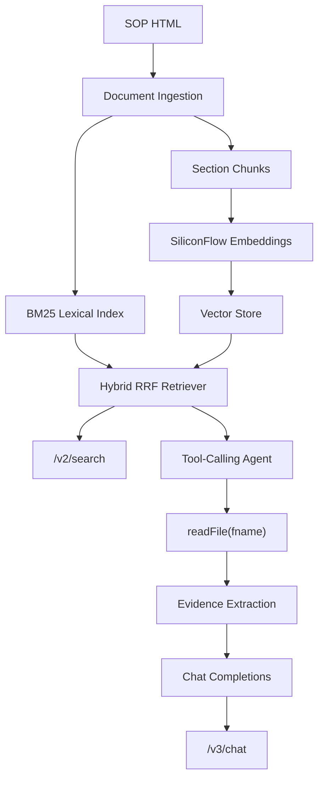

# Production-Grade On-Call Copilot Implementation Plan

> **For agentic workers:** REQUIRED SUB-SKILL: Use superpowers:subagent-driven-development (recommended) or superpowers:executing-plans to implement this plan task-by-task. Steps use checkbox (`- [ ]`) syntax for tracking.

**Goal:** Upgrade the current README-compliant baseline into a resume-grade On-Call Copilot with BM25 lexical search, real SiliconFlow embedding retrieval, OpenAI Chat Completions tool-calling, frontend/backend separation, traceable evidence, and quality gates.

**Architecture:** Keep the README route contract intact (`/v1`, `/v1/search`, `/v1/documents`, `/v2`, `/v2/search`, `/v3`, and a `/v3/chat` API), but split the implementation into cohesive packages: API routing, frontend static assets, document ingestion, lexical retrieval, vector retrieval, hybrid RAG retrieval, and tool-calling agent execution. The production path uses SiliconFlow embeddings for v2 and an OpenAI Chat Completions-compatible Codex proxy for v3; tests use fake clients and integration tests are opt-in.

**Tech Stack:** Python 3.11+, FastAPI/Uvicorn, Pydantic, httpx, BeautifulSoup4, jieba, numpy, SQLite embedding cache, unittest/pytest-compatible tests, pylint, ruff, mypy, vanilla HTML/CSS/JS frontend.

---

## Scope Rules

- README behavior is the source of truth. All original validation cases must continue to pass.
- Do not remove the current baseline until the replacement route is tested.
- Keep `data/` SOP files as source documents. Generated helper files such as `data/sop-index.json` are allowed because README explicitly permits adding files under `data/`.
- The Agent must still expose exactly one domain tool: `readFile(fname: string) -> string`.
- The Agent must not list directories, glob, or accept path traversal.
- Frontend and backend are separated by files and responsibilities:
  - `frontend/` contains static HTML/CSS/JS only.
  - `oncall_app/api/` serves API and static frontend.
  - Business logic lives outside the API layer.
- Real API calls must be hidden behind interfaces:
  - Unit tests use fake embedding/chat clients.
  - Real SiliconFlow/Codex proxy calls only run when explicit environment variables are present.
- Every implementation task ends with:

```powershell
python -m unittest discover -v
python -m pylint app.py oncall_app tests
python -m ruff check .
python -m mypy oncall_app
git status --short
git commit -m "<message>"
```

## Target File Structure

```text
question-1/
├── app.py
├── pyproject.toml
├── requirements.txt
├── requirements-dev.txt
├── frontend/
│   ├── index.html
│   ├── app.js
│   └── styles.css
├── oncall_app/
│   ├── api/
│   │   ├── __init__.py
│   │   ├── app_factory.py
│   │   ├── router.py
│   │   ├── schemas.py
│   │   └── static_files.py
│   ├── documents/
│   │   ├── __init__.py
│   │   ├── parser.py
│   │   ├── repository.py
│   │   ├── sections.py
│   │   └── manifest.py
│   ├── retrieval/
│   │   ├── __init__.py
│   │   ├── tokenize.py
│   │   ├── bm25.py
│   │   ├── chunking.py
│   │   ├── embeddings.py
│   │   ├── vector_store.py
│   │   ├── hybrid.py
│   │   └── service.py
│   ├── llm/
│   │   ├── __init__.py
│   │   ├── config.py
│   │   ├── openai_compat.py
│   │   ├── embedding_client.py
│   │   └── chat_client.py
│   ├── agent/
│   │   ├── __init__.py
│   │   ├── assistant.py
│   │   ├── prompts.py
│   │   ├── state.py
│   │   ├── tools.py
│   │   ├── evidence.py
│   │   ├── synthesizer.py
│   │   └── trace.py
│   ├── evaluation/
│   │   ├── __init__.py
│   │   ├── cases.py
│   │   ├── metrics.py
│   │   └── runner.py
│   └── models.py
├── tests/
│   ├── api/
│   ├── documents/
│   ├── retrieval/
│   ├── llm/
│   ├── agent/
│   └── evaluation/
└── docs/
    ├── ARCHITECTURE.md
    └── DEV_LOG.md
```

## Task 1: Tooling and FastAPI Shell

**Files:**
- Modify: `requirements.txt`
- Modify: `requirements-dev.txt`
- Create: `pyproject.toml`
- Modify: `app.py`
- Create: `oncall_app/api/__init__.py`
- Create: `oncall_app/api/app_factory.py`
- Create: `oncall_app/api/router.py`
- Create: `tests/api/test_app_shell.py`

- [ ] **Step 1: Write failing API shell tests**

Create `tests/api/test_app_shell.py`:

```python
"""FastAPI shell tests."""

import unittest

from fastapi.testclient import TestClient

from oncall_app.api.app_factory import create_app


class AppShellTest(unittest.TestCase):
    """Application shell behavior."""

    def test_health_endpoint(self):
        client = TestClient(create_app())

        response = client.get("/health")

        self.assertEqual(response.status_code, 200)
        self.assertEqual(response.json(), {"status": "ok"})

    def test_readme_pages_exist(self):
        client = TestClient(create_app())

        for path in ("/v1", "/v2", "/v3"):
            with self.subTest(path=path):
                response = client.get(path)
                self.assertEqual(response.status_code, 200)
                self.assertIn("text/html", response.headers["content-type"])
```

- [ ] **Step 2: Verify RED**

Run:

```powershell
python -m unittest tests.api.test_app_shell -v
```

Expected: import failure because `oncall_app.api.app_factory` does not exist.

- [ ] **Step 3: Add dependencies and app shell**

Update `requirements.txt`:

```text
fastapi>=0.115,<1.0
uvicorn[standard]>=0.30,<1.0
pydantic>=2.7,<3.0
httpx>=0.27,<1.0
beautifulsoup4>=4.12,<5.0
jieba>=0.42,<1.0
numpy>=1.26,<3.0
```

Update `requirements-dev.txt`:

```text
pylint>=3.0,<4.0
ruff>=0.6,<1.0
mypy>=1.10,<2.0
types-beautifulsoup4>=4.12,<5.0
```

Create `pyproject.toml`:

```toml
[tool.ruff]
line-length = 100
target-version = "py311"

[tool.ruff.lint]
select = ["E", "F", "I", "B", "UP"]

[tool.mypy]
python_version = "3.11"
ignore_missing_imports = true
warn_unused_ignores = true
warn_return_any = true
disallow_untyped_defs = false
```

Create `oncall_app/api/app_factory.py`:

```python
"""FastAPI application factory."""

from fastapi import FastAPI

from oncall_app.api.router import router


def create_app() -> FastAPI:
    """Build the HTTP application."""
    app = FastAPI(title="On-Call Copilot")
    app.include_router(router)
    return app
```

Create `oncall_app/api/router.py`:

```python
"""HTTP route declarations."""

from fastapi import APIRouter, Response

router = APIRouter()


@router.get("/health")
def health() -> dict[str, str]:
    """Return process health."""
    return {"status": "ok"}


@router.get("/v1", response_class=Response)
@router.get("/v2", response_class=Response)
@router.get("/v3", response_class=Response)
def frontend_page() -> Response:
    """Serve the frontend shell for each README page route."""
    return Response("<!doctype html><html><body><div id='app'></div></body></html>", media_type="text/html")
```

Modify `app.py`:

```python
"""Entry point for the On-Call Copilot web application."""

import uvicorn

from oncall_app.api.app_factory import create_app


app = create_app()


def main() -> None:
    """Start the local development server."""
    uvicorn.run("app:app", host="127.0.0.1", port=8000, reload=False)


if __name__ == "__main__":
    main()
```

- [ ] **Step 4: Verify GREEN and commit**

Run:

```powershell
python -m pip install -r requirements.txt -r requirements-dev.txt
python -m unittest tests.api.test_app_shell -v
python -m pylint app.py oncall_app tests
python -m ruff check .
python -m mypy oncall_app
git add app.py requirements.txt requirements-dev.txt pyproject.toml oncall_app/api tests/api
git commit -m "chore: add FastAPI application shell"
```

## Task 2: Frontend/Backend Separation

**Files:**
- Create: `frontend/index.html`
- Create: `frontend/app.js`
- Create: `frontend/styles.css`
- Create: `oncall_app/api/static_files.py`
- Modify: `oncall_app/api/router.py`
- Create: `tests/api/test_frontend_static.py`

- [ ] **Step 1: Write failing frontend separation tests**

Create `tests/api/test_frontend_static.py`:

```python
"""Tests for separated frontend assets."""

from pathlib import Path
import unittest

from fastapi.testclient import TestClient

from oncall_app.api.app_factory import create_app


PROJECT_ROOT = Path(__file__).resolve().parents[2]


class FrontendStaticTest(unittest.TestCase):
    """Frontend assets are separate from route code."""

    def test_frontend_files_exist(self):
        for name in ("index.html", "app.js", "styles.css"):
            self.assertTrue((PROJECT_ROOT / "frontend" / name).is_file())

    def test_pages_use_static_frontend_shell(self):
        client = TestClient(create_app())

        response = client.get("/v3")

        self.assertEqual(response.status_code, 200)
        self.assertIn('<script src="/static/app.js"', response.text)
        self.assertIn('<link rel="stylesheet" href="/static/styles.css"', response.text)

    def test_static_js_calls_readme_api_routes(self):
        js = (PROJECT_ROOT / "frontend" / "app.js").read_text(encoding="utf-8")

        self.assertIn("/v1/search", js)
        self.assertIn("/v2/search", js)
        self.assertIn("/v3/chat", js)
```

- [ ] **Step 2: Verify RED**

Run:

```powershell
python -m unittest tests.api.test_frontend_static -v
```

Expected: missing `frontend/` files.

- [ ] **Step 3: Implement static frontend shell**

Create `frontend/index.html`:

```html
<!doctype html>
<html lang="zh-CN">
<head>
  <meta charset="utf-8">
  <meta name="viewport" content="width=device-width, initial-scale=1">
  <title>On-Call Copilot</title>
  <link rel="stylesheet" href="/static/styles.css">
</head>
<body>
  <main>
    <nav>
      <a href="/v1">v1 Search</a>
      <a href="/v2">v2 RAG Retriever</a>
      <a href="/v3">v3 Agent</a>
    </nav>
    <section id="app" data-route=""></section>
  </main>
  <script src="/static/app.js"></script>
</body>
</html>
```

Create `frontend/app.js`:

```javascript
const app = document.querySelector("#app");
const route = window.location.pathname;

function renderSearch(version, endpoint, title) {
  app.innerHTML = `
    <h1>${title}</h1>
    <form id="search-form">
      <input name="q" placeholder="输入关键词或问题" autofocus />
      <button type="submit">搜索</button>
    </form>
    <section id="results"></section>
  `;
  document.querySelector("#search-form").addEventListener("submit", async (event) => {
    event.preventDefault();
    const q = new FormData(event.target).get("q") || "";
    const response = await fetch(`${endpoint}?q=${encodeURIComponent(q)}`);
    const payload = await response.json();
    document.querySelector("#results").innerHTML = payload.results.map((item) => `
      <article>
        <h2>${item.title}</h2>
        <p>${item.snippet}</p>
        <small>${version} · ${item.id} · score=${item.score}</small>
      </article>
    `).join("") || "<p>没有结果</p>";
  });
}

function renderChat() {
  app.innerHTML = `
    <h1>v3 On-Call Agent</h1>
    <form id="chat-form">
      <textarea name="message" placeholder="例如：服务 OOM 了怎么办？"></textarea>
      <button type="submit">发送</button>
    </form>
    <section id="trace"></section>
    <section id="answer"></section>
  `;
  document.querySelector("#chat-form").addEventListener("submit", async (event) => {
    event.preventDefault();
    const message = new FormData(event.target).get("message") || "";
    const response = await fetch("/v3/chat", {
      method: "POST",
      headers: { "Content-Type": "application/json" },
      body: JSON.stringify({ message }),
    });
    const payload = await response.json();
    document.querySelector("#trace").innerHTML = payload.tool_calls.map((call) => `
      <pre>${call.tool}("${call.fname}")\n${call.result_preview || ""}</pre>
    `).join("");
    document.querySelector("#answer").innerHTML = `<pre>${payload.answer}</pre>`;
  });
}

if (route === "/v1") {
  renderSearch("v1", "/v1/search", "v1 BM25 Keyword Search");
} else if (route === "/v2") {
  renderSearch("v2", "/v2/search", "v2 RAG Retriever");
} else {
  renderChat();
}
```

Create `frontend/styles.css`:

```css
body {
  font-family: system-ui, sans-serif;
  margin: 0;
  color: #1f2933;
  background: #f7f8fa;
}

main {
  max-width: 960px;
  margin: 0 auto;
  padding: 28px;
}

nav {
  display: flex;
  gap: 16px;
  margin-bottom: 24px;
}

input,
textarea {
  width: min(760px, 100%);
  padding: 10px;
  border: 1px solid #ccd3dc;
}

textarea {
  min-height: 96px;
}

button {
  margin-top: 8px;
  padding: 9px 14px;
}

article,
pre {
  background: white;
  border: 1px solid #e2e8f0;
  padding: 14px;
}
```

Create `oncall_app/api/static_files.py`:

```python
"""Static frontend loading."""

from pathlib import Path


PROJECT_ROOT = Path(__file__).resolve().parents[2]
FRONTEND_DIR = PROJECT_ROOT / "frontend"


def read_frontend_shell() -> str:
    """Read the static frontend HTML shell."""
    return (FRONTEND_DIR / "index.html").read_text(encoding="utf-8")
```

Update `oncall_app/api/router.py` to return `read_frontend_shell()` for `/v1`, `/v2`, `/v3`, and mount `/static` in `app_factory.py` using `StaticFiles(directory=FRONTEND_DIR)`.

- [ ] **Step 4: Verify and commit**

Run:

```powershell
python -m unittest tests.api.test_frontend_static -v
python -m unittest discover -v
python -m pylint app.py oncall_app tests
python -m ruff check .
python -m mypy oncall_app
git add frontend oncall_app/api tests/api
git commit -m "refactor: separate static frontend from backend API"
```

## Task 3: Structured Document Ingestion

**Files:**
- Create: `oncall_app/documents/__init__.py`
- Create: `oncall_app/documents/parser.py`
- Create: `oncall_app/documents/sections.py`
- Create: `oncall_app/documents/repository.py`
- Create: `oncall_app/documents/manifest.py`
- Modify: `oncall_app/models.py`
- Create: `tests/documents/test_structured_documents.py`

- [ ] **Step 1: Write failing structured parser tests**

Create `tests/documents/test_structured_documents.py`:

```python
"""Structured document ingestion tests."""

from pathlib import Path
import unittest

from oncall_app.documents.repository import DocumentRepository

PROJECT_ROOT = Path(__file__).resolve().parents[2]
DATA_DIR = PROJECT_ROOT / "data"


class StructuredDocumentTest(unittest.TestCase):
    """SOP documents are parsed into clean sections."""

    def test_script_and_style_are_not_visible_text(self):
        repository = DocumentRepository(DATA_DIR)
        document = repository.get("sop-002")

        self.assertIn("主从复制状态", document.text)
        self.assertNotIn("replicationLag", document.text)
        self.assertNotIn("font-family", document.text)

    def test_sections_preserve_headings(self):
        repository = DocumentRepository(DATA_DIR)
        document = repository.get("sop-001")
        headings = [section.heading for section in document.sections]

        self.assertIn("三、常见故障处理", headings)
        self.assertIn("场景二：单服务OOM崩溃", headings)

    def test_manifest_contains_all_files(self):
        repository = DocumentRepository(DATA_DIR)
        manifest = repository.build_manifest()

        self.assertEqual(len(manifest.entries), 10)
        self.assertIn("sop-001.html", [entry.file for entry in manifest.entries])
```

- [ ] **Step 2: Verify RED**

Run:

```powershell
python -m unittest tests.documents.test_structured_documents -v
```

Expected: import failure because `oncall_app.documents` does not exist.

- [ ] **Step 3: Implement structured document models and parser**

Add to `oncall_app/models.py`:

```python
@dataclass(frozen=True)
class Section:
    """A structured SOP section."""

    heading: str
    level: int
    text: str


@dataclass(frozen=True)
class ManifestEntry:
    """A file-level summary for Agent file selection."""

    file: str
    doc_id: str
    title: str
    topics: list[str]


@dataclass(frozen=True)
class SopManifest:
    """Index manifest stored in data/sop-index.json."""

    entries: list[ManifestEntry]
```

Implement `documents/parser.py` with BeautifulSoup:

- Remove `script` and `style`.
- Extract title from `<title>` or `<h1>`.
- Extract visible text.
- Extract sections from `h2`, `h3`, and following `p` content.
- Decode entities through BeautifulSoup's text extraction.

Implement `documents/repository.py` with:

- `all_documents()`
- `get(doc_id)`
- `add_document(doc_id, html)`
- `read_file(fname)`
- `build_manifest()`
- `write_manifest(fname="sop-index.json")`

Implement `documents/manifest.py` to infer topics from section headings and high-frequency domain tokens.

- [ ] **Step 4: Verify and commit**

Run:

```powershell
python -m unittest tests.documents.test_structured_documents -v
python -m unittest discover -v
python -m pylint app.py oncall_app tests
python -m ruff check .
python -m mypy oncall_app
git add oncall_app/documents oncall_app/models.py tests/documents
git commit -m "refactor: add structured SOP ingestion"
```

## Task 4: BM25 Lexical Retrieval for v1

**Files:**
- Create: `oncall_app/retrieval/__init__.py`
- Create: `oncall_app/retrieval/tokenize.py`
- Create: `oncall_app/retrieval/bm25.py`
- Create: `oncall_app/retrieval/service.py`
- Modify: `oncall_app/api/router.py`
- Create: `tests/retrieval/test_bm25_search.py`

- [ ] **Step 1: Write failing BM25 tests**

Create `tests/retrieval/test_bm25_search.py`:

```python
"""BM25 lexical retrieval tests."""

from pathlib import Path
import unittest

from oncall_app.documents.repository import DocumentRepository
from oncall_app.retrieval.service import RetrievalService

PROJECT_ROOT = Path(__file__).resolve().parents[2]
DATA_DIR = PROJECT_ROOT / "data"


class BM25SearchTest(unittest.TestCase):
    """Phase 1 lexical retrieval behavior."""

    def setUp(self):
        repository = DocumentRepository(DATA_DIR)
        self.service = RetrievalService.from_documents(repository.all_documents())

    def test_oom_returns_backend_sop(self):
        results = self.service.keyword_search("OOM")

        self.assertEqual(results[0].doc_id, "sop-001")
        self.assertIn("OOM", results[0].snippet)

    def test_replication_inside_script_is_not_indexed(self):
        results = self.service.keyword_search("replication")

        self.assertEqual(results, [])

    def test_cdn_returns_frontend_and_network_sops(self):
        results = self.service.keyword_search("CDN")
        ids = [result.doc_id for result in results]

        self.assertIn("sop-003", ids)
        self.assertIn("sop-010", ids)

    def test_ampersand_query_matches_decoded_text(self):
        results = self.service.keyword_search("&")
        ids = [result.doc_id for result in results]

        self.assertIn("sop-003", ids)
        self.assertIn("sop-010", ids)
```

- [ ] **Step 2: Verify RED**

Run:

```powershell
python -m unittest tests.retrieval.test_bm25_search -v
```

Expected: import failure because retrieval modules do not exist.

- [ ] **Step 3: Implement tokenizer and BM25**

Implement `retrieval/tokenize.py`:

- Use `jieba.cut_for_search` for Chinese text.
- Preserve uppercase abbreviations such as `OOM`, `CDN`, `DNS`, `P0`, `QPS`.
- Add character bigrams for Chinese fallback.
- Preserve literal `&`.

Implement `retrieval/bm25.py`:

```python
score = idf * tf * (k1 + 1) / (tf + k1 * (1 - b + b * doc_len / avg_doc_len))
```

Use:

```python
k1 = 1.5
b = 0.75
```

Implement `RetrievalService.keyword_search()` to return README-compatible `SearchResult`.

- [ ] **Step 4: Verify API route and commit**

Run:

```powershell
python -m unittest tests.retrieval.test_bm25_search -v
python -m unittest tests.test_routes -v
python -m unittest discover -v
python -m pylint app.py oncall_app tests
python -m ruff check .
python -m mypy oncall_app
git add oncall_app/retrieval oncall_app/api tests/retrieval
git commit -m "feat: replace v1 count search with BM25 retrieval"
```

## Task 5: LLM Provider Configuration and OpenAI-Compatible Clients

**Files:**
- Create: `oncall_app/llm/__init__.py`
- Create: `oncall_app/llm/config.py`
- Create: `oncall_app/llm/openai_compat.py`
- Create: `oncall_app/llm/embedding_client.py`
- Create: `oncall_app/llm/chat_client.py`
- Create: `tests/llm/test_llm_clients.py`

- [ ] **Step 1: Write failing client tests**

Create `tests/llm/test_llm_clients.py`:

```python
"""OpenAI-compatible client tests."""

import unittest

from oncall_app.llm.config import ProviderConfig
from oncall_app.llm.openai_compat import OpenAICompatClient


class FakeTransport:
    """Fake transport recording request payloads."""

    def __init__(self):
        self.last_path = ""
        self.last_payload = {}

    def post_json(self, path, payload, headers):
        self.last_path = path
        self.last_payload = payload
        if path == "/embeddings":
            return {"data": [{"embedding": [1.0, 0.0, 0.0]}]}
        return {"choices": [{"message": {"role": "assistant", "content": "ok"}}]}


class OpenAICompatClientTest(unittest.TestCase):
    """Client builds correct OpenAI-compatible requests."""

    def test_embedding_request_uses_embeddings_endpoint(self):
        transport = FakeTransport()
        client = OpenAICompatClient(
            ProviderConfig(base_url="https://example.test/v1", api_key="key", model="embed"),
            transport=transport,
        )

        result = client.create_embedding("hello")

        self.assertEqual(transport.last_path, "/embeddings")
        self.assertEqual(transport.last_payload["model"], "embed")
        self.assertEqual(result, [1.0, 0.0, 0.0])

    def test_chat_request_uses_chat_completions_endpoint(self):
        transport = FakeTransport()
        client = OpenAICompatClient(
            ProviderConfig(base_url="https://example.test/v1", api_key="key", model="chat"),
            transport=transport,
        )

        result = client.create_chat_completion([{"role": "user", "content": "hi"}], tools=[])

        self.assertEqual(transport.last_path, "/chat/completions")
        self.assertEqual(transport.last_payload["model"], "chat")
        self.assertEqual(result["choices"][0]["message"]["content"], "ok")
```

- [ ] **Step 2: Verify RED**

Run:

```powershell
python -m unittest tests.llm.test_llm_clients -v
```

Expected: import failure because `oncall_app.llm` does not exist.

- [ ] **Step 3: Implement OpenAI-compatible abstraction**

`ProviderConfig` reads:

```text
ONCALL_EMBEDDING_BASE_URL
ONCALL_EMBEDDING_API_KEY
ONCALL_EMBEDDING_MODEL=Qwen/Qwen3-Embedding-0.6B
ONCALL_CHAT_BASE_URL
ONCALL_CHAT_API_KEY
ONCALL_CHAT_MODEL
```

`OpenAICompatClient` exposes:

```python
create_embedding(text: str) -> list[float]
create_chat_completion(messages: list[dict[str, object]], tools: list[dict[str, object]]) -> dict[str, object]
```

Do not import provider-specific SDKs. Use `httpx.Client` to call:

```text
POST /embeddings
POST /chat/completions
```

- [ ] **Step 4: Verify and commit**

Run:

```powershell
python -m unittest tests.llm.test_llm_clients -v
python -m unittest discover -v
python -m pylint app.py oncall_app tests
python -m ruff check .
python -m mypy oncall_app
git add oncall_app/llm tests/llm requirements.txt
git commit -m "feat: add OpenAI-compatible LLM clients"
```

## Task 6: Embedding Cache and Vector Store

**Files:**
- Create: `oncall_app/retrieval/embeddings.py`
- Create: `oncall_app/retrieval/vector_store.py`
- Modify: `oncall_app/retrieval/chunking.py`
- Create: `tests/retrieval/test_vector_retrieval.py`

- [ ] **Step 1: Write failing vector retrieval tests**

Create `tests/retrieval/test_vector_retrieval.py`:

```python
"""Vector retrieval tests."""

from pathlib import Path
import unittest

from oncall_app.documents.repository import DocumentRepository
from oncall_app.retrieval.service import RetrievalService

PROJECT_ROOT = Path(__file__).resolve().parents[2]
DATA_DIR = PROJECT_ROOT / "data"


class FakeEmbeddingClient:
    """Deterministic embedding client for tests."""

    def embed(self, text):
        if "安全" in text or "入侵" in text or "黑客" in text or "漏洞" in text:
            return [1.0, 0.0, 0.0]
        if "推荐" in text or "模型" in text or "算法" in text:
            return [0.0, 1.0, 0.0]
        if "服务" in text or "K8s" in text or "超时" in text:
            return [0.0, 0.0, 1.0]
        return [0.1, 0.1, 0.1]


class VectorRetrievalTest(unittest.TestCase):
    """Embedding retrieval behavior."""

    def test_security_query_retrieves_security_sop(self):
        repository = DocumentRepository(DATA_DIR)
        service = RetrievalService.from_documents(
            repository.all_documents(),
            embedding_client=FakeEmbeddingClient(),
        )

        results = service.semantic_search("黑客攻击")

        self.assertEqual(results[0].doc_id, "sop-005")
        self.assertIn("安全", results[0].snippet)

    def test_model_query_retrieves_ai_sop(self):
        repository = DocumentRepository(DATA_DIR)
        service = RetrievalService.from_documents(
            repository.all_documents(),
            embedding_client=FakeEmbeddingClient(),
        )

        results = service.semantic_search("机器学习模型出问题")

        self.assertEqual(results[0].doc_id, "sop-008")
```

- [ ] **Step 2: Verify RED**

Run:

```powershell
python -m unittest tests.retrieval.test_vector_retrieval -v
```

Expected: failure because `semantic_search()` still does not use vector retrieval.

- [ ] **Step 3: Implement chunking, cache, vector store**

Implement:

- `chunking.py`: section-aware chunks with `chunk_id`, `doc_id`, `file`, `title`, `section_heading`, `text`.
- `embeddings.py`: `EmbeddingCache` backed by SQLite:
  - cache key = SHA256(model + text)
  - value = JSON vector
- `vector_store.py`:
  - normalize vectors
  - cosine similarity
  - top-k chunks

`RetrievalService.semantic_search()` should:

```text
query -> query embedding -> vector top-k chunks -> aggregate by doc -> snippet from best chunk
```

If no embedding client/config is available, keep a local lexical fallback so README routes still work without keys.

- [ ] **Step 4: Verify and commit**

Run:

```powershell
python -m unittest tests.retrieval.test_vector_retrieval -v
python -m unittest tests.test_semantic_search -v
python -m unittest discover -v
python -m pylint app.py oncall_app tests
python -m ruff check .
python -m mypy oncall_app
git add oncall_app/retrieval tests/retrieval
git commit -m "feat: add embedding vector retrieval for v2"
```

## Task 7: Hybrid Retrieval and RRF Rerank

**Files:**
- Create: `oncall_app/retrieval/hybrid.py`
- Modify: `oncall_app/retrieval/service.py`
- Create: `tests/retrieval/test_hybrid_retrieval.py`

- [ ] **Step 1: Write failing hybrid tests**

Create `tests/retrieval/test_hybrid_retrieval.py`:

```python
"""Hybrid retrieval tests."""

from pathlib import Path
import unittest

from oncall_app.documents.repository import DocumentRepository
from oncall_app.retrieval.service import RetrievalService

PROJECT_ROOT = Path(__file__).resolve().parents[2]
DATA_DIR = PROJECT_ROOT / "data"


class FakeEmbeddingClient:
    def embed(self, text):
        if "服务" in text or "K8s" in text or "服务器" in text:
            return [1.0, 0.0]
        return [0.0, 1.0]


class HybridRetrievalTest(unittest.TestCase):
    """Hybrid retrieval keeps lexical precision and semantic recall."""

    def test_server_down_returns_backend_and_sre_top_two(self):
        repository = DocumentRepository(DATA_DIR)
        service = RetrievalService.from_documents(
            repository.all_documents(),
            embedding_client=FakeEmbeddingClient(),
        )

        results = service.semantic_search("服务器挂了")
        top_two = {result.doc_id for result in results[:2]}

        self.assertEqual(top_two, {"sop-001", "sop-004"})

    def test_cdn_keeps_exact_lexical_matches(self):
        repository = DocumentRepository(DATA_DIR)
        service = RetrievalService.from_documents(
            repository.all_documents(),
            embedding_client=FakeEmbeddingClient(),
        )

        results = service.semantic_search("CDN")
        ids = [result.doc_id for result in results]

        self.assertIn("sop-003", ids)
        self.assertIn("sop-010", ids)
```

- [ ] **Step 2: Verify RED**

Run:

```powershell
python -m unittest tests.retrieval.test_hybrid_retrieval -v
```

Expected: current semantic ranking does not fuse lexical and vector rankings.

- [ ] **Step 3: Implement RRF fusion**

Implement `hybrid.py`:

```text
RRF score = sum(1 / (k + rank_i))
k = 60
```

Fuse:

- BM25 document ranking
- vector chunk ranking aggregated to document
- section title evidence boost

The service returns document results sorted by fused score with best evidence snippet.

- [ ] **Step 4: Verify and commit**

Run:

```powershell
python -m unittest tests.retrieval.test_hybrid_retrieval -v
python -m unittest tests.test_semantic_search -v
python -m unittest discover -v
python -m pylint app.py oncall_app tests
python -m ruff check .
python -m mypy oncall_app
git add oncall_app/retrieval tests/retrieval
git commit -m "feat: add hybrid retrieval and RRF reranking"
```

## Task 8: API Routes for v1/v2 Using RetrievalService

**Files:**
- Modify: `oncall_app/api/router.py`
- Modify: `oncall_app/api/schemas.py`
- Create: `tests/api/test_search_routes.py`

- [ ] **Step 1: Write failing route tests**

Create `tests/api/test_search_routes.py`:

```python
"""Search route tests."""

import unittest

from fastapi.testclient import TestClient

from oncall_app.api.app_factory import create_app


class SearchRouteTest(unittest.TestCase):
    """README search API behavior."""

    def setUp(self):
        self.client = TestClient(create_app())

    def test_v1_oom(self):
        response = self.client.get("/v1/search", params={"q": "OOM"})

        self.assertEqual(response.status_code, 200)
        self.assertEqual(response.json()["results"][0]["id"], "sop-001")

    def test_v1_replication_is_empty(self):
        response = self.client.get("/v1/search", params={"q": "replication"})

        self.assertEqual(response.status_code, 200)
        self.assertEqual(response.json()["results"], [])

    def test_v2_security_query(self):
        response = self.client.get("/v2/search", params={"q": "黑客攻击"})

        self.assertEqual(response.status_code, 200)
        self.assertEqual(response.json()["results"][0]["id"], "sop-005")

    def test_post_document_updates_v1_index(self):
        response = self.client.post(
            "/v1/documents",
            json={"id": "sop-test", "html": "<html><title>测试</title><body>OOM 测试</body></html>"},
        )

        self.assertEqual(response.status_code, 201)
        search = self.client.get("/v1/search", params={"q": "OOM"}).json()
        self.assertIn("sop-test", [item["id"] for item in search["results"]])
```

- [ ] **Step 2: Verify RED**

Run:

```powershell
python -m unittest tests.api.test_search_routes -v
```

Expected: failures until FastAPI routes are wired to retrieval services.

- [ ] **Step 3: Wire route layer without business logic**

`api/router.py` should only:

- parse request
- validate payload through Pydantic schema
- call `RetrievalService.keyword_search()`
- call `RetrievalService.semantic_search()`
- return response schema

It must not contain BM25/vector/scoring code.

- [ ] **Step 4: Verify and commit**

Run:

```powershell
python -m unittest tests.api.test_search_routes -v
python -m unittest discover -v
python -m pylint app.py oncall_app tests
python -m ruff check .
python -m mypy oncall_app
git add oncall_app/api tests/api
git commit -m "refactor: route v1 and v2 through retrieval services"
```

## Task 9: readFile Tool and Agent State

**Files:**
- Create: `oncall_app/agent/state.py`
- Create: `oncall_app/agent/tools.py`
- Create: `oncall_app/agent/trace.py`
- Create: `tests/agent/test_readfile_tool.py`

- [ ] **Step 1: Write failing readFile tool tests**

Create `tests/agent/test_readfile_tool.py`:

```python
"""readFile tool tests."""

from pathlib import Path
import unittest

from oncall_app.agent.tools import ReadFileTool
from oncall_app.documents.repository import DocumentRepository

PROJECT_ROOT = Path(__file__).resolve().parents[2]
DATA_DIR = PROJECT_ROOT / "data"


class ReadFileToolTest(unittest.TestCase):
    """Agent readFile tool safety."""

    def setUp(self):
        self.tool = ReadFileTool(DocumentRepository(DATA_DIR))

    def test_reads_direct_sop_file(self):
        result = self.tool.read_file("sop-001.html")

        self.assertIn("后端服务 On-Call SOP", result.content)
        self.assertEqual(result.call.tool, "readFile")
        self.assertEqual(result.call.fname, "sop-001.html")

    def test_rejects_path_traversal_and_glob(self):
        for fname in ("../README.md", "data/sop-001.html", "sop-*.html"):
            with self.subTest(fname=fname):
                with self.assertRaises(ValueError):
                    self.tool.read_file(fname)
```

- [ ] **Step 2: Verify RED**

Run:

```powershell
python -m unittest tests.agent.test_readfile_tool -v
```

Expected: import failure because new agent tool module does not exist.

- [ ] **Step 3: Implement tool and trace models**

`ReadFileTool` wraps repository access and returns:

```python
ToolObservation(
    content=raw_file_content,
    call=ToolCall(tool="readFile", fname=fname, result_preview=preview),
)
```

`trace.py` defines trace event types:

```text
plan_summary
tool_call
observation_summary
evidence
answer
```

Do not expose model chain-of-thought.

- [ ] **Step 4: Verify and commit**

Run:

```powershell
python -m unittest tests.agent.test_readfile_tool -v
python -m unittest discover -v
python -m pylint app.py oncall_app tests
python -m ruff check .
python -m mypy oncall_app
git add oncall_app/agent tests/agent
git commit -m "feat: add safe readFile agent tool"
```

## Task 10: Chat Completions Tool-Calling Agent

**Files:**
- Create: `oncall_app/agent/prompts.py`
- Create: `oncall_app/agent/assistant.py`
- Modify: `oncall_app/agent/evidence.py`
- Modify: `oncall_app/agent/synthesizer.py`
- Create: `tests/agent/test_tool_calling_agent.py`

- [ ] **Step 1: Write failing tool-calling tests**

Create `tests/agent/test_tool_calling_agent.py`:

```python
"""Tool-calling agent tests."""

from pathlib import Path
import unittest

from oncall_app.agent.assistant import OnCallAssistant
from oncall_app.documents.repository import DocumentRepository

PROJECT_ROOT = Path(__file__).resolve().parents[2]
DATA_DIR = PROJECT_ROOT / "data"


class FakeChatClient:
    """Fake Chat Completions client returning tool calls then final answer."""

    def __init__(self):
        self.calls = []

    def create_chat_completion(self, messages, tools):
        self.calls.append({"messages": messages, "tools": tools})
        if len(self.calls) == 1:
            return {
                "choices": [
                    {
                        "message": {
                            "role": "assistant",
                            "content": None,
                            "tool_calls": [
                                {
                                    "id": "call_1",
                                    "type": "function",
                                    "function": {
                                        "name": "readFile",
                                        "arguments": "{\"fname\":\"sop-001.html\"}",
                                    },
                                }
                            ],
                        }
                    }
                ]
            }
        return {
            "choices": [
                {
                    "message": {
                        "role": "assistant",
                        "content": "服务 OOM 时需要保存堆转储文件，并检查 JVM 内存曲线。",
                    }
                }
            ]
        }


class ToolCallingAgentTest(unittest.TestCase):
    """Agent uses Chat Completions tool calls."""

    def test_oom_uses_readfile_tool_call(self):
        assistant = OnCallAssistant(
            repository=DocumentRepository(DATA_DIR),
            chat_client=FakeChatClient(),
        )

        response = assistant.chat("服务 OOM 了怎么办？")

        self.assertEqual(response.tool_calls[0].tool, "readFile")
        self.assertEqual(response.tool_calls[0].fname, "sop-001.html")
        self.assertIn("堆转储", response.answer)
```

- [ ] **Step 2: Verify RED**

Run:

```powershell
python -m unittest tests.agent.test_tool_calling_agent -v
```

Expected: failure because `OnCallAssistant` does not exist.

- [ ] **Step 3: Implement true Chat Completions tool loop**

The agent loop:

1. Ensure `data/sop-index.json` exists from ingestion.
2. Add a first tool observation by calling `readFile("sop-index.json")`, or instruct the model to do so on first step. Prefer explicit first tool call in the trace for deterministic safety.
3. Send messages to Chat Completions with a single tool schema:

```json
{
  "type": "function",
  "function": {
    "name": "readFile",
    "description": "Read a direct file name from the data directory.",
    "parameters": {
      "type": "object",
      "properties": {
        "fname": {
          "type": "string",
          "description": "Direct file name, for example sop-001.html or sop-index.json."
        }
      },
      "required": ["fname"],
      "additionalProperties": false
    }
  }
}
```

4. Execute returned `tool_calls`.
5. Append tool results with role `tool`.
6. Repeat until final assistant content or `max_tool_rounds=4`.
7. Return final answer, tool calls, and evidence events.

The system prompt must state:

- Use only `readFile`.
- Do not ask for directory listings.
- Read `sop-index.json` before choosing SOPs when file identity is uncertain.
- Cite SOP file names and section headings.
- For P0 questions, read multiple relevant SOPs.

- [ ] **Step 4: Verify and commit**

Run:

```powershell
python -m unittest tests.agent.test_tool_calling_agent -v
python -m unittest tests.test_agent -v
python -m unittest discover -v
python -m pylint app.py oncall_app tests
python -m ruff check .
python -m mypy oncall_app
git add oncall_app/agent tests/agent
git commit -m "feat: add Chat Completions tool-calling agent"
```

## Task 11: Evidence Extraction and Answer Citations

**Files:**
- Create: `oncall_app/agent/evidence.py`
- Create: `oncall_app/agent/synthesizer.py`
- Modify: `oncall_app/agent/assistant.py`
- Create: `tests/agent/test_evidence.py`

- [ ] **Step 1: Write failing evidence tests**

Create `tests/agent/test_evidence.py`:

```python
"""Evidence extraction tests."""

from pathlib import Path
import unittest

from oncall_app.agent.evidence import EvidenceExtractor
from oncall_app.documents.repository import DocumentRepository

PROJECT_ROOT = Path(__file__).resolve().parents[2]
DATA_DIR = PROJECT_ROOT / "data"


class EvidenceExtractorTest(unittest.TestCase):
    """Relevant SOP sections are extracted for answers."""

    def test_oom_extracts_oom_section_and_escalation(self):
        repository = DocumentRepository(DATA_DIR)
        document = repository.get("sop-001")

        evidence = EvidenceExtractor().extract("服务 OOM 了怎么办？", [document])
        headings = [item.section_heading for item in evidence]

        self.assertIn("场景二：单服务OOM崩溃", headings)
        self.assertTrue(any("升级流程" in heading for heading in headings))

    def test_p0_extracts_multiple_documents(self):
        repository = DocumentRepository(DATA_DIR)
        documents = [repository.get("sop-001"), repository.get("sop-002"), repository.get("sop-005")]

        evidence = EvidenceExtractor().extract("P0 故障的响应流程是什么？", documents)
        files = {item.file for item in evidence}

        self.assertGreaterEqual(len(files), 2)
```

- [ ] **Step 2: Verify RED**

Run:

```powershell
python -m unittest tests.agent.test_evidence -v
```

Expected: import failure or missing extraction behavior.

- [ ] **Step 3: Implement evidence extraction**

Implement `EvidenceExtractor` using retrieval tokenizer and BM25 section scoring:

- query tokens vs section heading/text
- boost section headings containing scenario terms
- always include escalation section when query contains `P0`, `升级`, `响应流程`
- cap evidence to 5 sections

`synthesizer.py` formats evidence into a compact context for the LLM and fallback local answer.

- [ ] **Step 4: Verify and commit**

Run:

```powershell
python -m unittest tests.agent.test_evidence -v
python -m unittest discover -v
python -m pylint app.py oncall_app tests
python -m ruff check .
python -m mypy oncall_app
git add oncall_app/agent tests/agent
git commit -m "feat: add evidence extraction and citations"
```

## Task 12: v3 API Route and Trace UI

**Files:**
- Modify: `oncall_app/api/router.py`
- Modify: `oncall_app/api/schemas.py`
- Modify: `frontend/app.js`
- Modify: `frontend/styles.css`
- Create: `tests/api/test_agent_routes.py`

- [ ] **Step 1: Write failing v3 API tests**

Create `tests/api/test_agent_routes.py`:

```python
"""Agent API route tests."""

import unittest

from fastapi.testclient import TestClient

from oncall_app.api.app_factory import create_app


class AgentRouteTest(unittest.TestCase):
    """v3 chat API returns answer, tool calls, and trace."""

    def test_v3_chat_oom(self):
        client = TestClient(create_app(test_mode=True))

        response = client.post("/v3/chat", json={"message": "服务 OOM 了怎么办？"})
        payload = response.json()

        self.assertEqual(response.status_code, 200)
        self.assertIn("answer", payload)
        self.assertGreaterEqual(len(payload["tool_calls"]), 1)
        self.assertEqual(payload["tool_calls"][0]["tool"], "readFile")
        self.assertIn("trace", payload)
```

- [ ] **Step 2: Verify RED**

Run:

```powershell
python -m unittest tests.api.test_agent_routes -v
```

Expected: route not wired to new assistant response schema.

- [ ] **Step 3: Wire route and frontend**

`POST /v3/chat` returns:

```json
{
  "answer": "...",
  "tool_calls": [
    {"tool": "readFile", "fname": "sop-001.html", "result_preview": "..."}
  ],
  "evidence": [
    {"file": "sop-001.html", "section": "场景二：单服务OOM崩溃", "text": "..."}
  ],
  "trace": [
    {"type": "tool_call", "message": "readFile(\"sop-001.html\")"}
  ]
}
```

Frontend displays:

- tool calls
- observation summaries
- evidence cards
- final answer

Do not display chain-of-thought.

- [ ] **Step 4: Verify and commit**

Run:

```powershell
python -m unittest tests.api.test_agent_routes -v
python -m unittest discover -v
python -m pylint app.py oncall_app tests
python -m ruff check .
python -m mypy oncall_app
git add oncall_app/api frontend tests/api
git commit -m "feat: expose traceable v3 agent API"
```

## Task 13: Evaluation Harness

**Files:**
- Create: `oncall_app/evaluation/__init__.py`
- Create: `oncall_app/evaluation/cases.py`
- Create: `oncall_app/evaluation/metrics.py`
- Create: `oncall_app/evaluation/runner.py`
- Create: `tests/evaluation/test_eval_cases.py`
- Create: `scripts/evaluate.py`

- [ ] **Step 1: Write failing evaluation tests**

Create `tests/evaluation/test_eval_cases.py`:

```python
"""Evaluation harness tests."""

import unittest

from oncall_app.evaluation.cases import load_default_cases
from oncall_app.evaluation.metrics import hit_rate_at_k


class EvaluationTest(unittest.TestCase):
    """Evaluation cases and metrics."""

    def test_default_cases_cover_readme(self):
        cases = load_default_cases()
        queries = [case.query for case in cases]

        self.assertIn("服务 OOM 了怎么办？", queries)
        self.assertIn("黑客攻击", queries)

    def test_hit_rate_at_k(self):
        score = hit_rate_at_k(
            expected=[["sop-005"]],
            actual=[["sop-005", "sop-001"]],
            k=1,
        )

        self.assertEqual(score, 1.0)
```

- [ ] **Step 2: Verify RED**

Run:

```powershell
python -m unittest tests.evaluation.test_eval_cases -v
```

Expected: import failure because evaluation package does not exist.

- [ ] **Step 3: Implement eval harness**

Default cases include all README checks:

- v1 keyword expected docs
- v2 semantic expected docs
- v3 expected readFile files and must-include answer keywords

Metrics:

- `hit_rate_at_k`
- `mrr`
- agent tool-file accuracy
- must-include keyword coverage

`scripts/evaluate.py` prints a concise table.

- [ ] **Step 4: Verify and commit**

Run:

```powershell
python -m unittest tests.evaluation.test_eval_cases -v
python scripts/evaluate.py
python -m unittest discover -v
python -m pylint app.py oncall_app tests
python -m ruff check .
python -m mypy oncall_app
git add oncall_app/evaluation tests/evaluation scripts
git commit -m "feat: add retrieval and agent evaluation harness"
```

## Task 14: Optional Real API Integration Tests

**Files:**
- Create: `tests/integration/test_real_providers.py`
- Modify: `README.md`

- [ ] **Step 1: Write opt-in integration tests**

Create `tests/integration/test_real_providers.py`:

```python
"""Opt-in real provider integration tests."""

import os
import unittest

from oncall_app.llm.config import load_embedding_config, load_chat_config
from oncall_app.llm.openai_compat import OpenAICompatClient


@unittest.skipUnless(os.getenv("ONCALL_RUN_INTEGRATION") == "1", "integration tests disabled")
class RealProviderIntegrationTest(unittest.TestCase):
    """Real provider smoke tests."""

    def test_siliconflow_embedding(self):
        client = OpenAICompatClient(load_embedding_config())

        vector = client.create_embedding("服务 OOM 了怎么办？")

        self.assertGreater(len(vector), 10)

    def test_codex_proxy_chat(self):
        client = OpenAICompatClient(load_chat_config())

        response = client.create_chat_completion(
            [{"role": "user", "content": "只回复 ok"}],
            tools=[],
        )

        self.assertIn("choices", response)
```

- [ ] **Step 2: Verify skip behavior**

Run:

```powershell
python -m unittest tests.integration.test_real_providers -v
```

Expected: tests are skipped unless `ONCALL_RUN_INTEGRATION=1`.

- [ ] **Step 3: Add README environment variables**

Document:

```powershell
$env:ONCALL_EMBEDDING_BASE_URL="https://api.siliconflow.com/v1"
$env:ONCALL_EMBEDDING_API_KEY="..."
$env:ONCALL_EMBEDDING_MODEL="Qwen/Qwen3-Embedding-0.6B"

$env:ONCALL_CHAT_BASE_URL="https://your-codex-proxy/v1"
$env:ONCALL_CHAT_API_KEY="..."
$env:ONCALL_CHAT_MODEL="..."
```

Do not commit real keys.

- [ ] **Step 4: Verify and commit**

Run:

```powershell
python -m unittest tests.integration.test_real_providers -v
python -m unittest discover -v
python -m pylint app.py oncall_app tests
python -m ruff check .
python -m mypy oncall_app
git add tests/integration README.md
git commit -m "test: add opt-in real provider checks"
```

## Task 15: Architecture Docs and Interview Narrative

**Files:**
- Create: `docs/ARCHITECTURE.md`
- Create: `docs/DEV_LOG.md`
- Modify: `README.md`

- [ ] **Step 1: Write docs**

`docs/ARCHITECTURE.md` must include:



It must explain:

- why v1 is BM25
- why v2 is hybrid RAG retrieval
- why v3 is true tool-calling Agent
- why no chain-of-thought is displayed
- how `readFile` is sandboxed
- what AI assisted and what was manually designed

`docs/DEV_LOG.md` records:

- baseline implementation
- limitations found
- production-grade upgrade decisions
- rejected alternatives such as LangChain black-boxing

- [ ] **Step 2: Verify docs mention README contract**

Run:

```powershell
Select-String -Path docs\ARCHITECTURE.md -Pattern "/v1","/v2","/v3","readFile","BM25","Embedding","Chat Completions"
```

Expected: all terms appear.

- [ ] **Step 3: Final verification and commit**

Run:

```powershell
python -m unittest discover -v
python -m pylint app.py oncall_app tests
python -m ruff check .
python -m mypy oncall_app
git add README.md docs/ARCHITECTURE.md docs/DEV_LOG.md
git commit -m "docs: explain production-grade architecture"
```

## Final Acceptance Checklist

- [ ] `/v1/search?q=OOM` returns `sop-001`.
- [ ] `/v1/search?q=故障` returns multiple SOPs.
- [ ] `/v1/search?q=replication` returns empty.
- [ ] `/v1/search?q=CDN` returns `sop-003` and `sop-010`.
- [ ] `/v1/search?q=%26` or README `q=&` behavior returns docs with decoded `&`.
- [ ] `/v2/search?q=服务器挂了` ranks `sop-001` and `sop-004` near top.
- [ ] `/v2/search?q=黑客攻击` ranks `sop-005` first.
- [ ] `/v2/search?q=机器学习模型出问题` ranks `sop-008` first.
- [ ] `/v3/chat` for database replication delay calls `readFile("sop-002.html")`.
- [ ] `/v3/chat` for service OOM calls `readFile("sop-001.html")`.
- [ ] `/v3/chat` for P0 calls multiple SOP files.
- [ ] `/v3/chat` for intrusion calls `readFile("sop-005.html")`.
- [ ] `/v3/chat` for recommendation quality calls `readFile("sop-008.html")`.
- [ ] Frontend assets are under `frontend/` and routes serve static shell pages.
- [ ] API route layer contains no scoring, embedding, or tool execution internals.
- [ ] `readFile` rejects path traversal and wildcard file names.
- [ ] `python -m unittest discover -v` passes.
- [ ] `python -m pylint app.py oncall_app tests` passes.
- [ ] `python -m ruff check .` passes.
- [ ] `python -m mypy oncall_app` passes.
- [ ] `python scripts/evaluate.py` prints passing README metrics.
- [ ] Real provider tests are skipped by default and pass when configured.

## Self-Review

Spec coverage:
- Phase 1 keyword API and page are preserved and upgraded to BM25.
- Phase 2 semantic search is upgraded to real embedding retrieval with hybrid fallback and reranking.
- Phase 3 remains constrained to the single `readFile` tool while using real Chat Completions tool calls.
- Frontend/backend separation is explicit.
- README edge cases are represented in tests and final acceptance.

Placeholder scan:
- No task uses `TBD`, `TODO`, or vague "handle edge cases" wording.
- Each task names exact files, tests, commands, and commit messages.

Type consistency:
- Core models flow from `Document` and `Section` to chunks, results, tool calls, evidence, and API schemas.
- API routes call services rather than embedding business logic.
